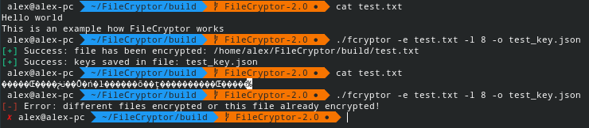
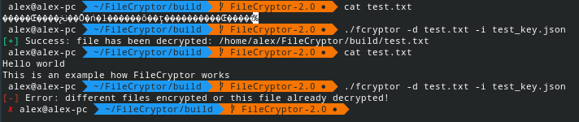

# FileCryptor

The simple file encryptor and decryptor program

based on logical XOR operation

For Unix-like OS only

## Dependencies
* CMake (>= 3.1)
* C++ complier (with C++17 support)
* Boost.Filesystem library

## Building
1. `mkdir build`
1. `cd build`
1. `cmake .. && make`

* Run `./fcryptor -h` for show help

## Examples
### Encryption example

### Decryption example

